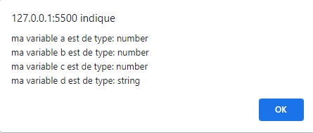
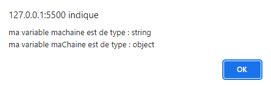
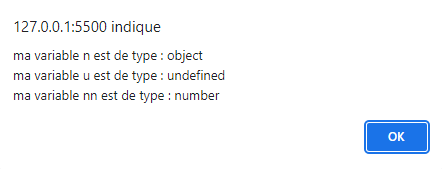

# <div align="center">Cours de Javascript</div>  
## Introduction au JavaScript  
# <div align="center"> </div>  
__Le JavaScript__ est un langage de programmation de scripts principalement employé dans les pages web interactives et à ce titre est une partie essentielle des applications web. Avec les langages HTML et CSS, JavaScript est au cœur des langages utilisés par les développeurs web.  

# Un pseudo cours [ici](https://www.pierre-giraud.com/javascript-apprendre-coder-cours/presentation-variable/)

## Qu’est-ce qu’une variable ?  
Une variable est un conteneur servant à stocker des informations de manière temporaire, comme une chaine de caractères (un texte) ou un nombre par exemple. 

Le propre d’une variable est de pouvoir varier, c’est-à-dire de pouvoir stocker différentes valeurs au fil du temps et c’est cette particularité qui les rend si utiles.
## Les règles de déclaration des variables en JavaScript

Pour pouvoir utiliser les variables et illustrer leur intérêt, il va déjà falloir les créer. Lorsqu’on crée une variable en JavaScript, on dit également qu’on « déclare » une variable.  

* Le nom d’une variable doit obligatoirement commencer par une lettre ou un underscore (_) et ne doit pas commencer par un chiffre ;
* Le nom d’une variable ne doit contenir que des lettres, des chiffres et des underscores mais pas de caractères spéciaux ;
* Le nom d’une variable ne doit pas contenir d’espace.
***
```
var maChaine = new String("exemple");
var a = 42;
var b = 4.2;
var c = -42;
var d = "42";
alert("ma variable a est de type: "+typeof a+"\nma variable b est de type: "+typeof b+"\nma variable c est de type: "+typeof c+"\nma variable d est de type: "+typeof d);
```

Ce qui donne:   

Les chiffres ont le type number et ce qui est dans les " sont identifié comme une chaine de caractère.
***
```
var machaine = "exemple";
var maChaine = new String("exemple");

alert("ma variable machaine est de type : "+typeof(machaine)+ "\nma variable maChaine est de type : "+typeof(maChaine));
```

Ce qui donne:   

Le premier on lui donne une nouvelle valeur qui est un string, le 2eme on crée un nouveau donc c'est un objet
***
```
var n = null;
var u = undefined;
var nn = NaN;

alert("ma variable n est de type : "+typeof(n)+ "\nma variable u est de type : "+typeof(u)+"\nma variable nn est de type : "+typeof(nn));
```

Ce qui donne:   


***


| Opérateurs de comparaison | Définition | Exemple |
|:--------------|:------:|---------------:|
| Egalité (==)| Renvoie true si les opérandes sont égaux (après conversion implicite). |"3" == 3 |
| Inéglité (!=)| Renvoie true si les opérandes sont différents (après conversion implicite). | 3 !==4 |
| Egalité sticte (===)| Renvoie true si les opérandes sont égaux et du même type. | 3 === '3' |
| Inégalité stricte (!==)| Renvoie true si les opérandes sont du même type et différents ou s'ils ne sont pas du même type. | 3 !== "3" |
| Supériorité stricte (>)| Renvoie true si l'opérande gauche est strictement supérieur à l'opérande droit. | "12" > 2 |
| Supériorité (>=)| Renvoie true si l'opérande gauche est supérieur ou égal à l'opérande droit. | 3>= 4 |
| Infériorité stricte (<) | Renvoie true si l'opérande gauche est strictement inférieur à l'opérande droit. | "2" < 12 |
| Infériorité (<=) | Renvoie true si l'opérande gauche est inférieur ou égal à l'opérande droit. | 2 <= 5 |

| Opérateurs arithmétiques | Définition | Exemple |
|:--------------|:------:|---------------:|
| Reste (%) | Un opérateur binaire qui renvoie le reste entier de la division des deux opérandes. | 12 % 5 renvoie 00 |
| Incrément (++) | Un opérateur unaire qui ajoute un à son opérande. S'il est utilisé en opérateur préfixe (++x), il renvoie la valeur de son opérande après y avoir ajouté un. S'il est utilisé en opérateur postfixe (x++), il renvoie la valeur de l'opérande avant l'ajout de un. | Si x vaut 3, alors ++x définit x avec 4 et renvoie 4, tandis que x++ renvoie 3 puis, uniquement après, définit x avec 4. |
| Décrément (--) | Un opérateur unaire qui soustrait un à son opérande. La valeur de retour est analogue à celle de l'opérateur d'incrément. | Si x vaut 3, alors --x définit x avec 2 et renvoie 2, tandis que x-- renvoie 3 puis, uniquement après, définit x avec 2. |
| Négation unaire (-) | Un opérateur unaire qui renvoie l'opposé de l'opérande. | Si x vaut 3, -x renvoie -3. |
| Plus unaire (+) | Un opérateur unaire qui tente la conversion de l'opérande en nombre si ce n'est pas déjà une valeur numérique. | +"3" renvoie 3. +true renvoie 1. |
| Opérateur d'exponentiation (**) | Élève une base donnée par l'opérande gauche à la puissance donnée par l'opérande droit. | 2 ** 3 renvoie 8. 10 ** -1 renvoie 0.1. |

| Opérateurs binaires | [cours](https://developer.mozilla.org/fr/docs/Web/JavaScript/Guide/Expressions_and_Operators#op%C3%A9rateurs_binaires) | ø |
|:--------------:| :------:|:---------------:|

***

var arrayNbr = [1, 2, 3];
var arrayStr = ["a", "b", "c"];


// arrayNbr.push(4); //[1, 2, 3, 4] ajoute
// arrayNbr.pop(); //[1, 2] retire le dernier
// arrayNbr.shift(); //[2, 3] retire le premier
// arrayNbr.unshift(0); //[0, 1, 2, 3] ajoute la valeur indiqué au début
// console.table(arrayNbr); //affiche le tableau dans la console
//...
// arrayStr.concat("d"); //fusionne des tableaux sans changer les valeurs du tableau initial
// arrayStr.joint("-"); // a-b-c joindre les valeurs du tableau sans changer les valeurs du tableau initial
// arrayStr.slice(2); // ["b", "c"] retire le nombre d'elements indiqué du tableau en partant du début sans changer les valeurs du tableau initial
// arrayStr.slice(-1); // ["b", "c"] retire le nombre d'elements indiqué du tableau en partant du début et en comptant depuis la fin sans changer les valeurs du tableau initial
// arrayStr.includes("c"); //regarde si "c" est inclu dans le tableau et envoi un boolean
// arrayStr.indexOf("c"); // donne l'index de la valeur du tableau
// arrayNbr.reduce((acc, cou)=> acc + cou) // 6 additions  
//arrayNbr.find(el => el > 2) //3 renvoie la valeur du premier élément trouvé dans le tableau qui respecte la condition
//arrayNbr.findIndex(el => el > 2) //2 renvoie l'index du premier élément trouvé dans le tableau qui respecte la condition
// arrayNbr.map(el => el * 2); //[2, 4, 6] crée un nouveau tableau avec les résultats de l'appel d'une fonction fournie sur chaque élément du tableau appelant.
// arrayNbr.some(el => el > 2); //true passe le test implémenté par la fonction fournie. Elle renvoie un booléen indiquant le résultat du test.
// arrayNbr.filter(el => el > 1) // [2,3] renvoi tous les éléments qui respectent la condition
// arrayNbr.every(el => el > 1);
// arrayNbr.reverse();